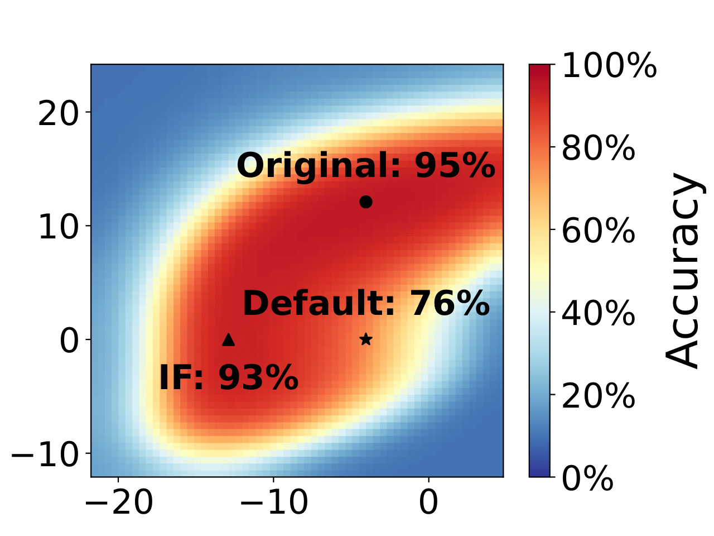
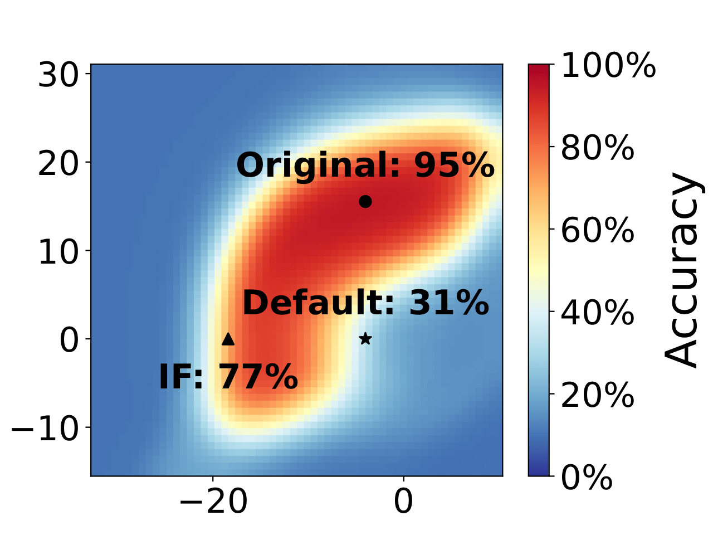

# Towards Meta-Pruning via Optimal Transport

  

## Introduction
This repository serves as an implementation of Intra-Fusion.

>Structural pruning of neural networks conventionally relies on identifying and discarding less important neurons, a practice often resulting in significant accuracy loss that necessitates subsequent fine-tuning efforts. This paper introduces a novel approach named Intra-Fusion, challenging this prevailing pruning paradigm. Unlike existing methods that focus on designing meaningful neuron importance metrics, Intra-Fusion redefines the overlying pruning procedure. Through utilizing the concepts of model fusion and Optimal Transport, we leverage an agnostically given importance metric to arrive at a more effective sparse model representation. Notably, our approach achieves substantial accuracy recovery without the need for resource-intensive fine-tuning, making it an efficient and promising tool for neural network compression.

## Requirements
- Python (v3.10.8)
- torch (v1.13.0)
- torchvision (v0.14.0)
- sklearn (v1.1.3)
- pot (v0.8.2)
- numpy (v1.24.2)
- pandas (v1.5.3)

## Sample commands
**Before executing the following commands, first unzip the models.zip folder!**

VGG11-BN on CIFAR-10. Groups 1, 2 and 3. Sparsities 30-70%. Pruning criteria: L1-norm.
```
python main.py --model-name vgg11_bn --group_idxs 1 2 3 \
--sparsities 0.3 0.4 0.5 0.6 0.7 --importance_criteria l1
```
VGG11-BN on CIFAR-10. Groups 1, 2 and 3. Sparsities 30-70%. Pruning criteria: Taylor.
```
python main.py --model-name vgg11_bn --group_idxs 1 2 3 \
--sparsities 0.3 0.4 0.5 0.6 0.7 --importance_criteria taylor
```
ResNet18 on CIFAR-10. Groups 1, 2 and 3. Sparsities 30-70%. Pruning criteria: L1-norm.
```
python main.py --model-name resnet18 --group_idxs 1 2 3 \
--sparsities 0.3 0.4 0.5 0.6 0.7 --importance_criteria l1
```
ResNet18 on CIFAR-10. Groups 1, 2 and 3. Sparsities 30-70%. Pruning criteria: Taylor.
```
python main.py --model-name resnet18 --group_idxs 1 2 3 \
--sparsities 0.3 0.4 0.5 0.6 0.7 --importance_criteria taylor
```

## Implementation details
The implementation of Intra-Fusion is built as an extension of an existing pruning library: https://github.com/VainF/Torch-Pruning.
Followingly, we want to highlight the specific changes we made to realize Intra-Fusion.

### Merging Batch-Normalization with the prior layer

File: torch_pruning/pruner/algorithms/metapruner.py

Function: merge_bn()

Here, the batchnormalization layer is merged with the layer it acts upon, thereby preserving the function output.

### Derivation of the Optimal Transport map

File: torch_pruning/optimal_transport.py

Class: OptimalTransport()

Calling this class will provide the optimal transport map that is later used to fuse maching neurons.

### Layer compression

File: torch_pruning/function.py

Function (line 96): _prune_parameter_and_grad()

Here, we are given the transport map, and followingly derive the compressed layer via matrix multiplication with the optimal transport map (ot_map).


